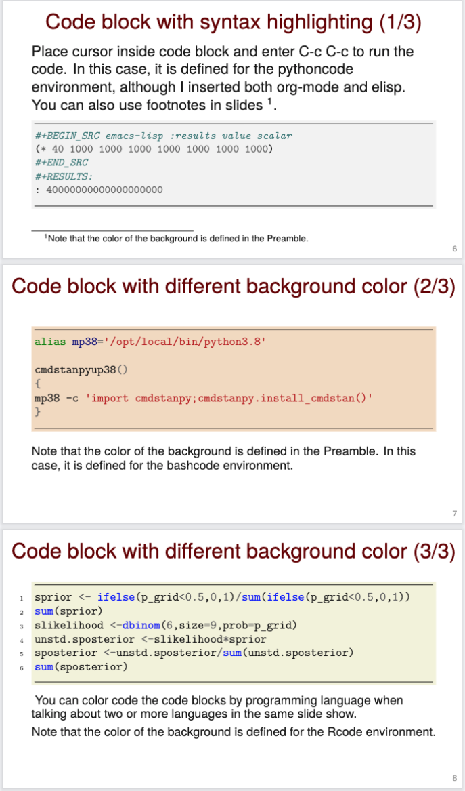

# Template for making slideshows in LaTeX

This template has my favorite settings after about eight years of use.
I strived to make it hard to tell that the slides were made with the beamer documentclass.
I included example slides for the following situations, which covers most scenarios:

- black bullet point list (no green triangle for points)
- imported image
- sample table
- code block on colored background and syntax highlighted by the minted package
- display equations

Duplicate the kind of slide that you need and delete or comment out the rest.

## Sample slide with a code block with colored background and syntax highlighting

## Related repos of possible interest

- [LaTeX manuscript template](https://github.com/MooersLab/manuscriptInLaTeX/edit/main/README.md)
- [Writing log template](https://github.com/MooersLab/writingLogTemplate)
- [Annotated Bibliography](https://github.com/MooersLab/annotatedBibliography)
- [Diary for 2022 in LaTeX](https://github.com/MooersLab/diary2022inLaTeX)
- [Diary for 2023 in LaTeX](https://github.com/MooersLab/diary2023inLaTeX)
- [latex-emacs profile](https://github.com/MooersLab/latex-emacs)
- [snippets for latex-mode in Emacs](https://github.com/MooersLab/snippet-latex-mode)
- [Quizzes about Emacs to improve recall of keybindings](https://github.com/MooersLab/qemacs)
- [Slides from talk about LaTeX in Emacs](https://github.com/MooersLab/BerlinEmacsAugust2022)
- [Slides from talk about GhostText](https://github.com/MooersLab/DSW22ghosttext)
- [Video link to talk about GhostText](https://mediasite.ouhsc.edu/Mediasite/Channel/python/watch/4da0872f028c4255ae12935655e911321d)
